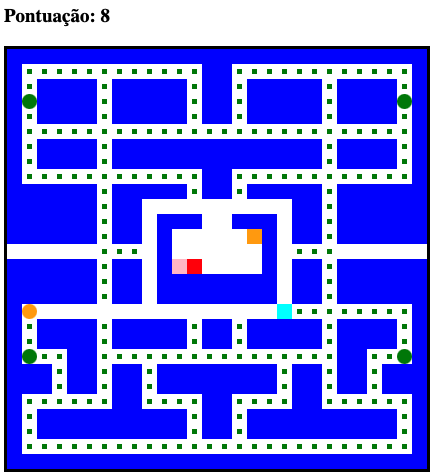
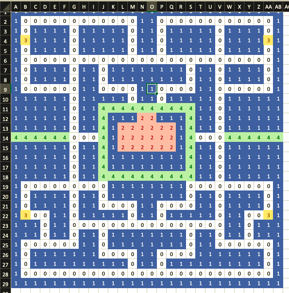

# Pacman Game

This project is a simple remake of the pacman game. Here I used HTML5, CSS3 and vanilla JavaScript.

To play, open the index.html file on your favorite web browser.

## Custom maze

If you wish to create your custom maze: 

1. Edit the xlsx file 
2. Copy the numbers
3. Paste them inside the index.js file
